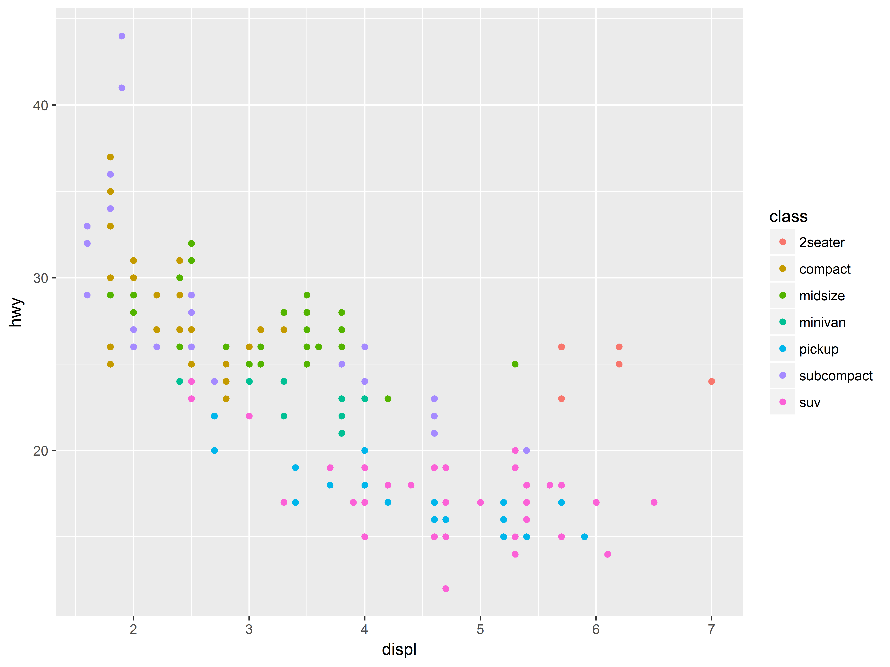
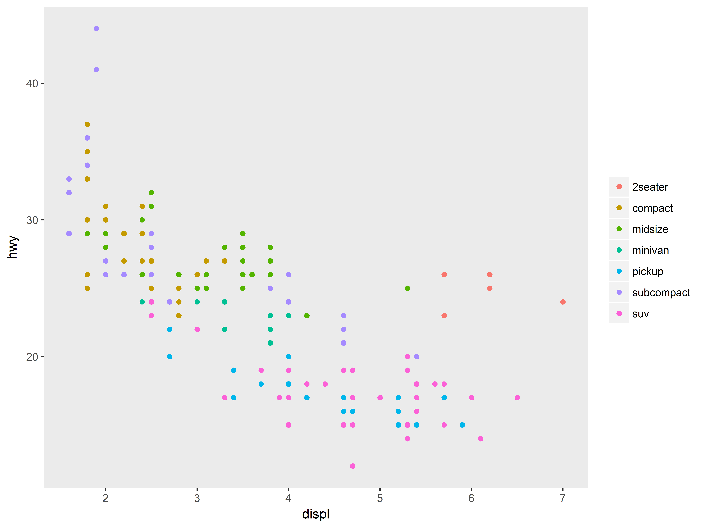
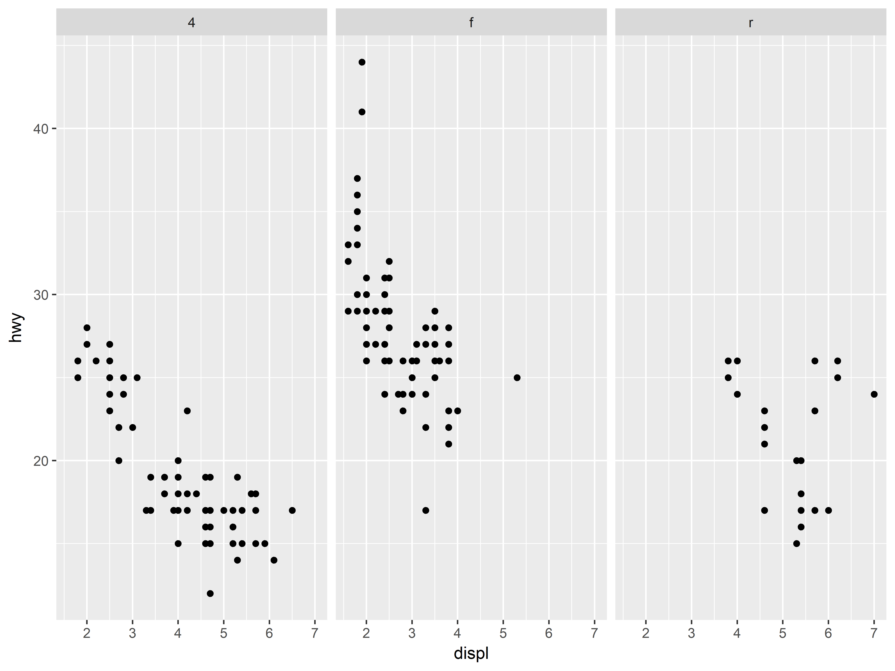
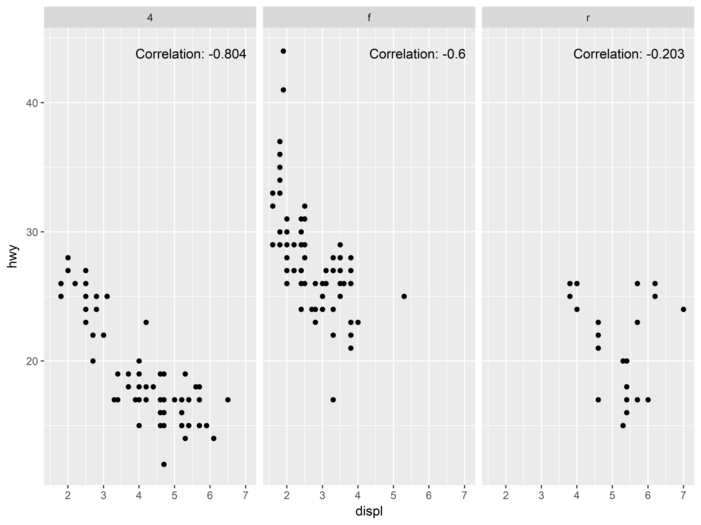

# ggutils

Overview
--------

ggutils contains utility functions for [ggplot2](http://ggplot2.org/) that retrieve information from, remove elements of, and add text to a plot object created by 'ggplot2'.

Installation
------------
```r
# Install from GitHub:
# install.packages("devtools")
devtools::install_github('statech/ggutils')
```

Usage
-----

The functions in `ggutils` falls into the following three categorires based on
the action applied onto a passed ggplot2 object

- Retrieve information
- Remove elements
- Add elements

### Retrieve information

Important aspects of a ggplot2 object such as axis range can be useful for later
use. `ggutils` contains utility functions to extract information of interest
from a ggplot2 object after being created. Those functions have names that
start with `gg_retrieve`.

```r
# create a boxplot with ggplot2
boxplot_ <- ggplot(mpg, aes(class, hwy)) +
    geom_boxplot() +
    facet_grid(~ cyl, scales = "free", space = "free")

print(gg_retrieve_x(boxplot_))      # print x variable

print(gg_retrieve_y(boxplot_))      # print y variable

print(gg_retrieve_range(boxplot_))  # Retrieve axis range in all panels

  cyl x_min x_max y_min y_max
1   4   0.4   6.6  10.4  45.6
2   5   0.4   2.6  10.4  45.6
3   6   0.4   6.6  10.4  45.6
4   8   0.4   5.6  10.4  45.6
```

### Remove elements

Functions in this category remove elements from a ggplot2 object with function
names starting with `gg_remove`. Examples are provided below to help illustrate.

```r
# create a scatter plot of hwy vs displ with point color controlled by class
scatter_plot <- ggplot(mpg, aes(displ, hwy, colour = class)) + geom_point()
```


```r
# remove legend title
scatter_plot_no_legttl <- gg_remove_legend_title(scatter_plot)
```


```r
# continue removing both x- and y-axis grids
scatter_plot_no_legttl_grids <- gg_remove_grid(scatter_plot_no_legttl)
```


```r
# equivalently, one can use `gg_remove` to remove all in once
scatter_plot_no_legttl_grids <- gg_remove(scatter_plot, c('legend_title', 'grid'))
```

### Add elements

Functions in this category will add elements to an existing ggplot2 object. One
good example is an implementation of adding text to a plot in a similar way to
`graphics::legend()`. In particular, with the help of `gg_retrieve_range()`,
axis range of an existing ggplot2 object can be conveniently retrieved and
furthered used in the implementation of text location that is specified by
setting x-axis coordinate to a single keyword from the list "bottomright", 
"bottom", "bottomleft", "left", "topleft", "top", "topright", "right" and 
"center". Examples are provided below for demonstration.

```r
# create a scatter plot of hwy vs displ in facetting column panels by drv
q <- ggplot(mpg, aes(displ, hwy)) + geom_point() + facet_wrap(~drv)
```


```r
# calculate correlation between hwy and displ in each panel
library(dplyr)
corr_df <- mpg %>%
    group_by(drv) %>%
    summarise(corr = paste('Correlation:', round(cor(hwy, displ), 3)))
# add the calculated correlation to the scatter plot
q_with_text <- gg_add_text(q, 'topright', text = corr_df$corr, on_border = FALSE)
```


Getting help
------------

The help page of ggutils package can be accessed by `help(package = 'ggutils')`. Most of the functions are documented and examples are provided to ease learning.


Contact
-------

If you have any questions or encounter any bugs, please contact the author (Feiyang Niu, statech.forums@gmail.com)
